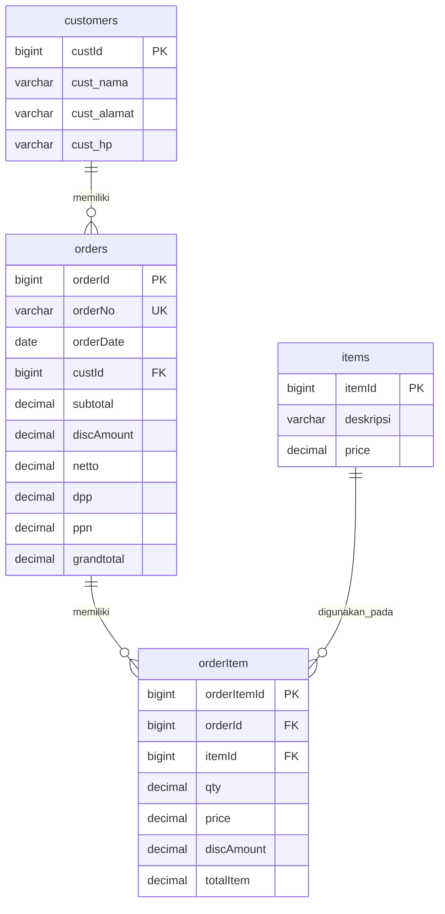
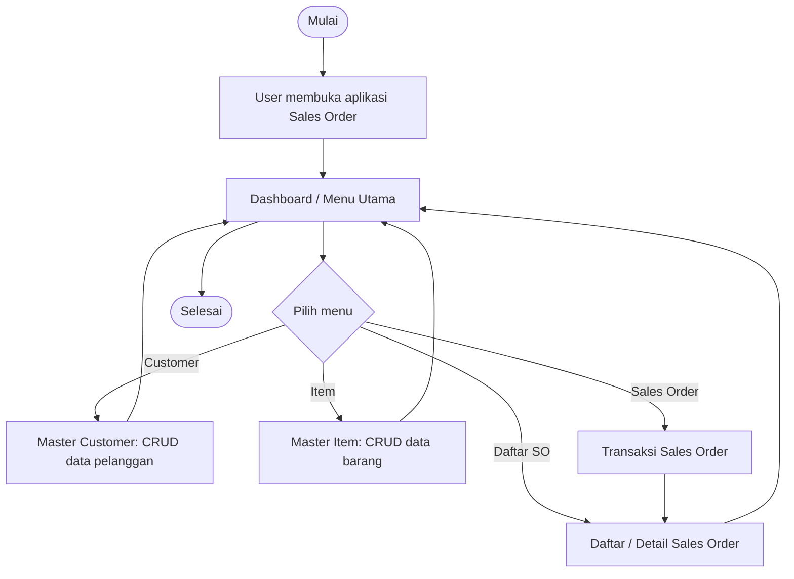
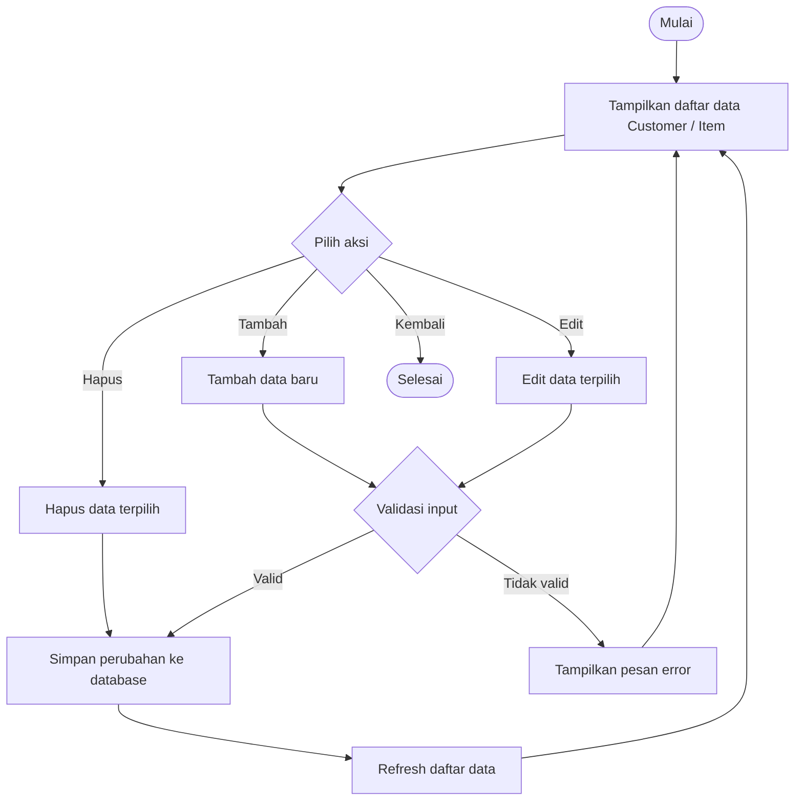
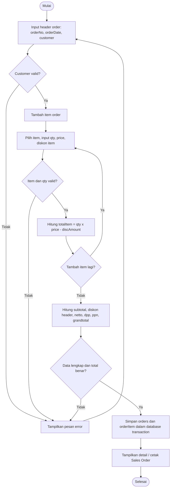

# Dokumen PRD, SRS, ERD, dan Flowchart Aplikasi Sales Order Laravel 13

**Studi kasus:** Aplikasi CRUD Customer, CRUD Item, dan Transaksi Sales Order  
**Framework:** Laravel 13  
**Database:** MySQL/MariaDB localhost  
**Versi dokumen:** 1.0  
**Tanggal:** 17 Juni 2026

---

## 1. Ringkasan Project

Project ini adalah aplikasi web sederhana berbasis Laravel 13 untuk mengelola proses Sales Order. Aplikasi memiliki master data customer, master data item, serta modul transaksi Sales Order yang menyimpan header order dan detail item order.

Database wajib memiliki empat tabel sesuai soal: `customers`, `items`, `orders`, dan `orderItem`. Sistem harus memiliki index database, foreign key antar tabel, fitur CRUD master customer, fitur CRUD master item, dan fitur transaksi Sales Order.

Catatan implementasi: nama tabel `orderItem` dan nama field camelCase mengikuti kebutuhan soal. Pada Laravel, tabel seperti `order_items` lebih umum dipakai, tetapi pada project ini model dapat diberi properti `$table = 'orderItem';` agar tetap sesuai soal.

---

## 2. PRD - Product Requirements Document

### 2.1 Latar Belakang

Dalam kegiatan penjualan, data pelanggan, data barang, dan transaksi pemesanan harus dicatat secara terstruktur. Pencatatan manual berisiko menyebabkan kesalahan perhitungan subtotal, diskon, DPP, PPN, dan grand total. Oleh karena itu, dibutuhkan aplikasi Sales Order berbasis web yang mampu mengelola master data dan transaksi secara konsisten.

### 2.2 Tujuan Produk

Tujuan utama produk adalah menyediakan aplikasi web Sales Order yang dapat digunakan untuk:

1. Mengelola data customer.
2. Mengelola data item/barang.
3. Membuat transaksi Sales Order.
4. Menyimpan data order dan item order ke database relasional.
5. Menghitung subtotal, diskon, netto, DPP, PPN, dan grand total secara otomatis.
6. Menjaga integritas data menggunakan primary key, index, dan foreign key.

### 2.3 Target Pengguna

| Pengguna | Deskripsi | Kebutuhan Utama |
|---|---|---|
| Admin Penjualan | Pengguna yang mengelola data master dan transaksi | CRUD customer, CRUD item, input Sales Order |
| Staff Sales | Pengguna yang membuat order pelanggan | Pilih customer, pilih item, input qty, lihat total |
| Owner/Supervisor | Pengguna yang memantau transaksi | Melihat daftar dan detail Sales Order |

### 2.4 Ruang Lingkup Produk

#### Termasuk dalam scope

1. Database localhost dengan empat tabel utama.
2. Index pada field penting untuk mempercepat pencarian.
3. Foreign key antar tabel.
4. CRUD master customer.
5. CRUD master item.
6. Transaksi Sales Order.
7. Perhitungan total transaksi.
8. Halaman daftar dan detail Sales Order.
9. Validasi input form.
10. Penanganan error sederhana.

#### Tidak termasuk dalam scope awal

1. Login multi-role.
2. Manajemen stok barang.
3. Invoice dan pembayaran.
4. Retur penjualan.
5. Export PDF/Excel.
6. API publik.
7. Integrasi payment gateway.

### 2.5 Fitur Utama

| Kode | Fitur | Deskripsi |
|---|---|---|
| PRD-01 | Master Customer | Pengguna dapat menambah, melihat, mengubah, dan menghapus data customer. |
| PRD-02 | Master Item | Pengguna dapat menambah, melihat, mengubah, dan menghapus data item. |
| PRD-03 | Sales Order | Pengguna dapat membuat order penjualan dengan satu customer dan banyak item. |
| PRD-04 | Kalkulasi Otomatis | Sistem menghitung subtotal, diskon, netto, DPP, PPN, dan grand total. |
| PRD-05 | Database Relasional | Sistem menyimpan data dengan relasi customer-order dan order-orderItem-item. |
| PRD-06 | Pencarian Data | Sistem menyediakan index agar pencarian customer, item, dan order lebih efisien. |

### 2.6 User Stories

| ID | User Story | Acceptance Criteria |
|---|---|---|
| US-01 | Sebagai admin, saya ingin menambahkan customer agar data pelanggan tersimpan. | Customer berhasil tersimpan jika nama, alamat, dan nomor HP valid. |
| US-02 | Sebagai admin, saya ingin mengubah data customer agar data pelanggan tetap akurat. | Perubahan data customer tersimpan dan muncul di daftar customer. |
| US-03 | Sebagai admin, saya ingin menambahkan item agar barang dapat dipilih dalam Sales Order. | Item tersimpan dengan deskripsi dan harga valid. |
| US-04 | Sebagai staff sales, saya ingin membuat Sales Order agar pesanan pelanggan tercatat. | Order tersimpan beserta minimal satu item order. |
| US-05 | Sebagai staff sales, saya ingin total transaksi dihitung otomatis agar mengurangi kesalahan hitung. | Subtotal, netto, DPP, PPN, dan grand total sesuai rumus sistem. |
| US-06 | Sebagai supervisor, saya ingin melihat detail order agar dapat memeriksa transaksi. | Detail order menampilkan header order, customer, dan seluruh item order. |

### 2.7 Kriteria Keberhasilan Produk

1. Pengguna dapat melakukan CRUD customer tanpa error.
2. Pengguna dapat melakukan CRUD item tanpa error.
3. Pengguna dapat membuat Sales Order dengan minimal satu item.
4. Data order tersimpan di tabel `orders` dan detail item tersimpan di tabel `orderItem`.
5. Foreign key mencegah data transaksi yang tidak valid.
6. Perhitungan total transaksi sesuai rumus.
7. Index database tersedia pada field yang sering dicari.

### 2.8 Asumsi Bisnis

1. Harga item (`price`) belum termasuk PPN.
2. Tarif PPN default adalah 11%.
3. Diskon item disimpan pada field `orderItem.discAmount`.
4. Diskon header order disimpan pada field `orders.discAmount`.
5. Satu Sales Order hanya memiliki satu customer.
6. Satu Sales Order dapat memiliki banyak item.
7. Satu item dapat muncul di banyak Sales Order.

---

## 3. SRS - Software Requirements Specification

### 3.1 Deskripsi Sistem

Aplikasi Sales Order adalah aplikasi web Laravel 13 yang berjalan di localhost dan menggunakan database MySQL/MariaDB. Aplikasi menyediakan halaman master customer, master item, dan transaksi Sales Order. Sistem menggunakan arsitektur MVC Laravel yang terdiri dari Model, View, Controller, Migration, Seeder, Route, dan Service untuk kalkulasi transaksi.

### 3.2 Aktor Sistem

| Aktor | Hak Akses |
|---|---|
| Admin/Staff | Mengakses dashboard, mengelola customer, mengelola item, membuat dan melihat Sales Order. |

Pada scope awal, autentikasi belum diwajibkan. Jika autentikasi ditambahkan, aktor Admin/Staff dapat menggunakan fitur login bawaan Laravel.

### 3.3 Kebutuhan Fungsional

| ID | Kebutuhan Fungsional | Prioritas |
|---|---|---|
| FR-01 | Sistem harus memiliki database localhost dengan tabel `customers`, `items`, `orders`, dan `orderItem`. | Must Have |
| FR-02 | Sistem harus memiliki primary key pada setiap tabel. | Must Have |
| FR-03 | Sistem harus memiliki index pada field penting seperti nama customer, nomor order, tanggal order, dan foreign key. | Must Have |
| FR-04 | Sistem harus memiliki foreign key dari `orders.custId` ke `customers.custId`. | Must Have |
| FR-05 | Sistem harus memiliki foreign key dari `orderItem.orderId` ke `orders.orderId`. | Must Have |
| FR-06 | Sistem harus memiliki foreign key dari `orderItem.itemId` ke `items.itemId`. | Must Have |
| FR-07 | Sistem harus menyediakan halaman daftar customer. | Must Have |
| FR-08 | Sistem harus menyediakan fitur tambah customer. | Must Have |
| FR-09 | Sistem harus menyediakan fitur edit customer. | Must Have |
| FR-10 | Sistem harus menyediakan fitur hapus customer. | Must Have |
| FR-11 | Sistem harus menyediakan halaman daftar item. | Must Have |
| FR-12 | Sistem harus menyediakan fitur tambah item. | Must Have |
| FR-13 | Sistem harus menyediakan fitur edit item. | Must Have |
| FR-14 | Sistem harus menyediakan fitur hapus item. | Must Have |
| FR-15 | Sistem harus menyediakan form input Sales Order. | Must Have |
| FR-16 | Sistem harus dapat memilih customer pada form Sales Order. | Must Have |
| FR-17 | Sistem harus dapat memilih lebih dari satu item pada form Sales Order. | Must Have |
| FR-18 | Sistem harus menghitung `totalItem` untuk setiap baris item. | Must Have |
| FR-19 | Sistem harus menghitung `subtotal`, `netto`, `dpp`, `ppn`, dan `grandtotal`. | Must Have |
| FR-20 | Sistem harus menyimpan header order ke tabel `orders`. | Must Have |
| FR-21 | Sistem harus menyimpan detail item order ke tabel `orderItem`. | Must Have |
| FR-22 | Sistem harus menampilkan daftar Sales Order. | Should Have |
| FR-23 | Sistem harus menampilkan detail Sales Order. | Should Have |
| FR-24 | Sistem harus menggunakan database transaction saat menyimpan Sales Order. | Must Have |

### 3.4 Kebutuhan Non-Fungsional

| ID | Kebutuhan Non-Fungsional | Deskripsi |
|---|---|---|
| NFR-01 | Usability | Form harus sederhana, mudah dipahami, dan memiliki pesan validasi. |
| NFR-02 | Reliability | Penyimpanan Sales Order harus menggunakan database transaction agar data header dan detail konsisten. |
| NFR-03 | Performance | Field pencarian dan foreign key harus diberi index. |
| NFR-04 | Maintainability | Kode mengikuti struktur MVC Laravel dan memisahkan kalkulasi ke service/helper. |
| NFR-05 | Security | Input harus divalidasi untuk mencegah data tidak valid dan serangan dasar seperti mass assignment. |
| NFR-06 | Compatibility | Sistem berjalan pada Laravel 13, PHP versi yang kompatibel, dan MySQL/MariaDB localhost. |

### 3.5 Business Rules

| ID | Aturan Bisnis |
|---|---|
| BR-01 | `cust_nama` wajib diisi. |
| BR-02 | `cust_hp` wajib diisi dan sebaiknya unik. |
| BR-03 | `deskripsi` item wajib diisi. |
| BR-04 | `price` item harus berupa angka dan bernilai minimal 0. |
| BR-05 | `orderNo` wajib unik. |
| BR-06 | `orderDate` wajib diisi. |
| BR-07 | Sales Order wajib memiliki customer valid. |
| BR-08 | Sales Order wajib memiliki minimal satu item. |
| BR-09 | `qty` item order harus lebih besar dari 0. |
| BR-10 | `discAmount` tidak boleh lebih besar dari nilai bruto item/order. |
| BR-11 | Customer yang sudah memiliki order tidak boleh dihapus secara langsung, kecuali menggunakan soft delete atau validasi pencegahan. |
| BR-12 | Item yang sudah digunakan pada order tidak boleh dihapus secara langsung, kecuali menggunakan soft delete atau validasi pencegahan. |

### 3.6 Rumus Perhitungan Transaksi

Asumsi: harga item belum termasuk PPN dan tarif PPN adalah 11%.

```text
brutoItem  = qty x price
totalItem  = brutoItem - discAmountItem
subtotal   = SUM(totalItem)
netto      = subtotal - discAmountOrder
dpp        = netto
ppn        = dpp x 11%
grandtotal = netto + ppn
```

### 3.7 Validasi Input

#### Validasi Customer

| Field | Aturan Validasi |
|---|---|
| cust_nama | required, string, max 100 |
| cust_alamat | nullable/string, max 255 |
| cust_hp | required, string, max 20 |

#### Validasi Item

| Field | Aturan Validasi |
|---|---|
| deskripsi | required, string, max 150 |
| price | required, numeric, min 0 |

#### Validasi Sales Order

| Field | Aturan Validasi |
|---|---|
| orderNo | required, unique orders.orderNo |
| orderDate | required, date |
| custId | required, exists customers.custId |
| items | required, array, min 1 |
| items.*.itemId | required, exists items.itemId |
| items.*.qty | required, numeric, min 1 |
| items.*.price | required, numeric, min 0 |
| items.*.discAmount | nullable, numeric, min 0 |
| discAmount | nullable, numeric, min 0 |

### 3.8 Desain Database

#### Tabel `customers`

| Field | Tipe Data | Key | Keterangan |
|---|---|---|---|
| custId | BIGINT UNSIGNED AUTO_INCREMENT | PK | ID customer |
| cust_nama | VARCHAR(100) | IDX | Nama customer |
| cust_alamat | VARCHAR(255) | - | Alamat customer |
| cust_hp | VARCHAR(20) | IDX | Nomor HP customer |

#### Tabel `items`

| Field | Tipe Data | Key | Keterangan |
|---|---|---|---|
| itemId | BIGINT UNSIGNED AUTO_INCREMENT | PK | ID item |
| deskripsi | VARCHAR(150) | IDX | Nama/deskripsi barang |
| price | DECIMAL(15,2) | - | Harga barang |

#### Tabel `orders`

| Field | Tipe Data | Key | Keterangan |
|---|---|---|---|
| orderId | BIGINT UNSIGNED AUTO_INCREMENT | PK | ID order |
| orderNo | VARCHAR(30) | UNIQUE | Nomor order |
| orderDate | DATE | IDX | Tanggal order |
| custId | BIGINT UNSIGNED | FK, IDX | Referensi customer |
| subtotal | DECIMAL(15,2) | - | Total sebelum diskon header |
| discAmount | DECIMAL(15,2) | - | Diskon header order |
| netto | DECIMAL(15,2) | - | Subtotal setelah diskon |
| dpp | DECIMAL(15,2) | - | Dasar pengenaan pajak |
| ppn | DECIMAL(15,2) | - | Pajak pertambahan nilai |
| grandtotal | DECIMAL(15,2) | - | Total akhir |

#### Tabel `orderItem`

| Field | Tipe Data | Key | Keterangan |
|---|---|---|---|
| orderItemId | BIGINT UNSIGNED AUTO_INCREMENT | PK | ID detail order |
| orderId | BIGINT UNSIGNED | FK, IDX | Referensi order |
| itemId | BIGINT UNSIGNED | FK, IDX | Referensi item |
| qty | DECIMAL(15,2) | - | Jumlah item |
| price | DECIMAL(15,2) | - | Harga item saat transaksi |
| discAmount | DECIMAL(15,2) | - | Diskon item |
| totalItem | DECIMAL(15,2) | - | Total per item |

### 3.9 Index Database yang Disarankan

| Tabel | Nama Index | Field | Jenis |
|---|---|---|---|
| customers | PRIMARY | custId | Primary Key |
| customers | idx_customers_nama | cust_nama | Index |
| customers | idx_customers_hp | cust_hp | Index |
| items | PRIMARY | itemId | Primary Key |
| items | idx_items_deskripsi | deskripsi | Index |
| orders | PRIMARY | orderId | Primary Key |
| orders | uq_orders_orderNo | orderNo | Unique Index |
| orders | idx_orders_orderDate | orderDate | Index |
| orders | idx_orders_custId | custId | Index |
| orders | idx_orders_cust_date | custId, orderDate | Composite Index |
| orderItem | PRIMARY | orderItemId | Primary Key |
| orderItem | idx_orderItem_orderId | orderId | Index |
| orderItem | idx_orderItem_itemId | itemId | Index |
| orderItem | idx_orderItem_order_item | orderId, itemId | Composite Index |

### 3.10 Relasi Antar Tabel

| Relasi | Cardinality | Keterangan |
|---|---|---|
| customers ke orders | 1:N | Satu customer dapat memiliki banyak order. |
| orders ke orderItem | 1:N | Satu order dapat memiliki banyak detail item. |
| items ke orderItem | 1:N | Satu item dapat muncul di banyak detail order. |

### 3.11 Struktur MVC Laravel yang Disarankan

| Komponen | Nama File/Class | Tanggung Jawab |
|---|---|---|
| Model | Customer | Representasi tabel customers. |
| Model | Item | Representasi tabel items. |
| Model | Order | Representasi tabel orders. |
| Model | OrderItem | Representasi tabel orderItem. |
| Controller | CustomerController | CRUD customer. |
| Controller | ItemController | CRUD item. |
| Controller | SalesOrderController | Form, simpan, daftar, dan detail Sales Order. |
| Service | SalesOrderCalculator | Menghitung subtotal, diskon, netto, DPP, PPN, dan grand total. |
| Migration | create_customers_table | Membuat tabel customers. |
| Migration | create_items_table | Membuat tabel items. |
| Migration | create_orders_table | Membuat tabel orders. |
| Migration | create_order_item_table | Membuat tabel orderItem. |

### 3.12 Route Web yang Disarankan

```php
Route::resource('customers', CustomerController::class);
Route::resource('items', ItemController::class);
Route::get('sales-orders', [SalesOrderController::class, 'index'])->name('sales-orders.index');
Route::get('sales-orders/create', [SalesOrderController::class, 'create'])->name('sales-orders.create');
Route::post('sales-orders', [SalesOrderController::class, 'store'])->name('sales-orders.store');
Route::get('sales-orders/{order}', [SalesOrderController::class, 'show'])->name('sales-orders.show');
```

### 3.13 Kebutuhan Antarmuka

| Halaman | Komponen Utama |
|---|---|
| Dashboard | Menu Customer, Item, Sales Order, Daftar Sales Order |
| Customer Index | Tabel customer, tombol tambah, edit, hapus, pencarian |
| Customer Form | Input nama, alamat, nomor HP, tombol simpan |
| Item Index | Tabel item, tombol tambah, edit, hapus, pencarian |
| Item Form | Input deskripsi, harga, tombol simpan |
| Sales Order Create | Pilih customer, nomor order, tanggal order, detail item dinamis, ringkasan total |
| Sales Order Detail | Informasi order, customer, tabel item order, total transaksi |

### 3.14 Skenario Pengujian

| ID | Skenario | Hasil yang Diharapkan |
|---|---|---|
| TC-01 | Tambah customer dengan data valid | Data tersimpan dan muncul di daftar customer. |
| TC-02 | Tambah customer tanpa nama | Sistem menampilkan pesan validasi. |
| TC-03 | Tambah item dengan harga valid | Data item tersimpan. |
| TC-04 | Tambah item dengan harga negatif | Sistem menolak input. |
| TC-05 | Buat Sales Order dengan satu item | Header dan detail order tersimpan. |
| TC-06 | Buat Sales Order tanpa customer | Sistem menampilkan pesan validasi. |
| TC-07 | Buat Sales Order tanpa item | Sistem menampilkan pesan validasi. |
| TC-08 | Buat Sales Order dengan diskon item | `totalItem` sesuai rumus. |
| TC-09 | Buat Sales Order dengan diskon header | `netto` dan `grandtotal` sesuai rumus. |
| TC-10 | Hapus customer yang sudah memiliki order | Sistem menolak penghapusan atau menampilkan error relasi. |

---

## 4. ERD - Entity Relationship Diagram

### 4.1 Diagram ERD


### 4.2 Mermaid ERD



---

## 5. Flowchart

### 5.1 Flowchart Menu Utama




### 5.2 Flowchart CRUD Master Customer dan Item




### 5.3 Flowchart Transaksi Sales Order




---

## 6. Rancangan SQL DDL

Berikut contoh rancangan SQL untuk database MySQL/MariaDB localhost.

```sql
CREATE TABLE customers (
    custId BIGINT UNSIGNED AUTO_INCREMENT PRIMARY KEY,
    cust_nama VARCHAR(100) NOT NULL,
    cust_alamat VARCHAR(255) NULL,
    cust_hp VARCHAR(20) NOT NULL,
    INDEX idx_customers_nama (cust_nama),
    INDEX idx_customers_hp (cust_hp)
);

CREATE TABLE items (
    itemId BIGINT UNSIGNED AUTO_INCREMENT PRIMARY KEY,
    deskripsi VARCHAR(150) NOT NULL,
    price DECIMAL(15,2) NOT NULL DEFAULT 0,
    INDEX idx_items_deskripsi (deskripsi)
);

CREATE TABLE orders (
    orderId BIGINT UNSIGNED AUTO_INCREMENT PRIMARY KEY,
    orderNo VARCHAR(30) NOT NULL,
    orderDate DATE NOT NULL,
    custId BIGINT UNSIGNED NOT NULL,
    subtotal DECIMAL(15,2) NOT NULL DEFAULT 0,
    discAmount DECIMAL(15,2) NOT NULL DEFAULT 0,
    netto DECIMAL(15,2) NOT NULL DEFAULT 0,
    dpp DECIMAL(15,2) NOT NULL DEFAULT 0,
    ppn DECIMAL(15,2) NOT NULL DEFAULT 0,
    grandtotal DECIMAL(15,2) NOT NULL DEFAULT 0,
    UNIQUE KEY uq_orders_orderNo (orderNo),
    INDEX idx_orders_orderDate (orderDate),
    INDEX idx_orders_custId (custId),
    INDEX idx_orders_cust_date (custId, orderDate),
    CONSTRAINT fk_orders_customers
        FOREIGN KEY (custId) REFERENCES customers(custId)
        ON UPDATE CASCADE
        ON DELETE RESTRICT
);

CREATE TABLE orderItem (
    orderItemId BIGINT UNSIGNED AUTO_INCREMENT PRIMARY KEY,
    orderId BIGINT UNSIGNED NOT NULL,
    itemId BIGINT UNSIGNED NOT NULL,
    qty DECIMAL(15,2) NOT NULL DEFAULT 0,
    price DECIMAL(15,2) NOT NULL DEFAULT 0,
    discAmount DECIMAL(15,2) NOT NULL DEFAULT 0,
    totalItem DECIMAL(15,2) NOT NULL DEFAULT 0,
    INDEX idx_orderItem_orderId (orderId),
    INDEX idx_orderItem_itemId (itemId),
    INDEX idx_orderItem_order_item (orderId, itemId),
    CONSTRAINT fk_orderItem_orders
        FOREIGN KEY (orderId) REFERENCES orders(orderId)
        ON UPDATE CASCADE
        ON DELETE CASCADE,
    CONSTRAINT fk_orderItem_items
        FOREIGN KEY (itemId) REFERENCES items(itemId)
        ON UPDATE CASCADE
        ON DELETE RESTRICT
);
```

---

## 7. Catatan Implementasi Laravel 13

### 7.1 Urutan Pembuatan Migration

1. `create_customers_table`
2. `create_items_table`
3. `create_orders_table`
4. `create_order_item_table`

Urutan tersebut penting karena tabel `orders` membutuhkan tabel `customers`, sedangkan tabel `orderItem` membutuhkan tabel `orders` dan `items`.

### 7.2 Relasi Model Laravel

| Model | Relasi | Contoh Method |
|---|---|---|
| Customer | hasMany Order | `orders()` |
| Order | belongsTo Customer | `customer()` |
| Order | hasMany OrderItem | `items()` atau `orderItems()` |
| OrderItem | belongsTo Order | `order()` |
| OrderItem | belongsTo Item | `item()` |
| Item | hasMany OrderItem | `orderItems()` |

Karena field primary key tidak menggunakan nama default `id`, setiap model perlu mengatur `$primaryKey`. Untuk tabel `orderItem`, model juga perlu mengatur `$table = 'orderItem';`.

### 7.3 Contoh Properti Model

```php
class Customer extends Model
{
    protected $table = 'customers';
    protected $primaryKey = 'custId';
    public $timestamps = false;
    protected $fillable = ['cust_nama', 'cust_alamat', 'cust_hp'];
}

class OrderItem extends Model
{
    protected $table = 'orderItem';
    protected $primaryKey = 'orderItemId';
    public $timestamps = false;
    protected $fillable = ['orderId', 'itemId', 'qty', 'price', 'discAmount', 'totalItem'];
}
```

### 7.4 Catatan Database Transaction

Penyimpanan Sales Order sebaiknya menggunakan database transaction. Jika penyimpanan detail item gagal, maka penyimpanan header order juga harus dibatalkan. Hal ini mencegah data order menggantung tanpa detail item.

Contoh alur penyimpanan:

1. Validasi request.
2. Mulai database transaction.
3. Hitung seluruh total transaksi.
4. Simpan data ke tabel `orders`.
5. Simpan setiap baris item ke tabel `orderItem`.
6. Commit jika semua berhasil.
7. Rollback jika terjadi error.

---

## 8. Kesimpulan

Dokumen ini menjelaskan rancangan aplikasi Sales Order berbasis Laravel 13 sesuai studi kasus. Sistem terdiri dari empat tabel utama, yaitu `customers`, `items`, `orders`, dan `orderItem`. Relasi utama adalah customer memiliki banyak order, order memiliki banyak detail order, dan item dapat muncul di banyak detail order. Fitur utama yang harus dibuat adalah CRUD master customer, CRUD master item, dan transaksi Sales Order dengan perhitungan total otomatis.
